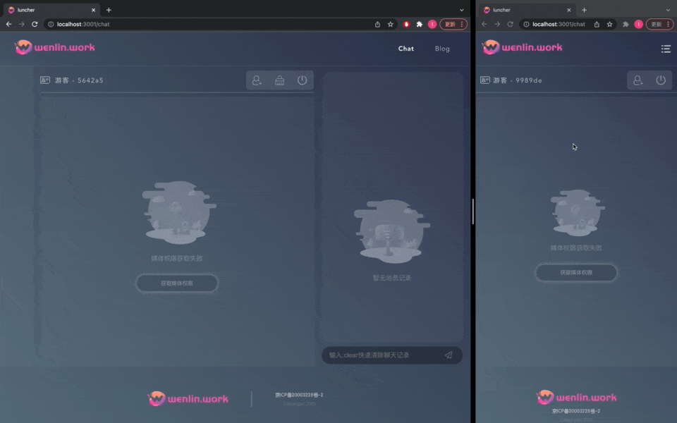

## Introduction

🏠 A simple chat room by vue3 & webrtc.

## View



## How To Use

### dev

```shell
yarn dev
```

### build

```shell
yarn build
```

### config

```js
// src/lib/config.js
// defult

const PAGE_CHAT_RTC_SIGNAL_PATH = 'ws://localhost:3883' // Your signal server path

const PAGE_CHAT_RTC_CONFIG = {
  iceServers: [
    { urls: 'stun:stun1.l.google.com:19302' }
  ]
}
// Your STUN or TURN config
```